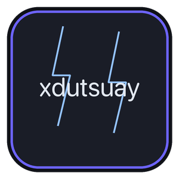

<h1 align="center">chidori-nagasa</h1>

<p align="center">

</p>

chidori-nagasa is the Android companion to [chidori](https://kaustubhtripathi.com/public/lab/lclreason/),
the AI-powered desktop IDE ([lclreason](https://github.com/xdutsuay/lclreason)). It runs LLMs
locally on-device — download models, load them in one tap, and chat, all offline, all private —
and pairs with a running chidori desktop instance over your local network to check on its
coordinator, watch Ask/Agent/Plan/Debug runs, and chat through its local/remote models from your
phone.

This project is a fork of [LM Playground](https://github.com/andriydruk/LMPlayground) by
Andriy Druk, used as the base for on-device inference. See `NOTICE.md` for full attribution.
Powered by [llama.cpp](https://github.com/ggml-org/llama.cpp) with GGUF-format models from
[Hugging Face](https://huggingface.co/).

Governance for this repo — including how it stays in sync with `lclreason` and the engineering
rules that apply to changes here — lives in [`CHIDORI_PROTOCOL.md`](CHIDORI_PROTOCOL.md). Product
scope for the first release is in [`PRD.md`](PRD.md), phased plan in [`ROADMAP.md`](ROADMAP.md),
the wire contract in [`WIRE_CONTRACT.md`](WIRE_CONTRACT.md), and the test/release gate in
[`TEST_PLAN.md`](TEST_PLAN.md). If you're picking up work on the `lclreason` desktop side to make
pairing/monitor/chat actually connect, start at [`DESKTOP_HANDOFF.md`](DESKTOP_HANDOFF.md) — it's
the implementation brief for the server half of this contract.

Grab a test build from the [Releases page](https://github.com/xdutsuay/chidori-nagasa/releases) —
debug-signed APKs, no Play Store account needed.


## Features

On-device (inherited from LM Playground, rebranded, kept working — see `TEST_PLAN.md` §2.1):

- **On-device inference** - no cloud, no API keys, fully offline
- **Vision/image input** - attach a photo from your gallery or camera and ask vision-capable models about it (Gemma 4, Gemma 3, Qwen 3.5, Ministral 3)
- **Rich markdown** in chat responses - headers, code blocks, lists, and more
- **Reasoning model support** - thinking steps from models like GPT-OSS, DeepSeek R1, and Nemotron are displayed in a styled section
- **Tools** - capable models can search the web, fetch a page, and run JavaScript mid-reply; each tool is off by default and enabled per model
- **Reusable system prompts** - save a persona, tone, or output format once and apply it to any model
- **Chat history** - conversations are saved and organized; pin, rename, delete, and resume sessions from the sidebar
- **Custom GGUF models** - load your own model files from any source alongside the built-in catalog
- **Reliable background downloads** - custom download engine with OkHttp and WorkManager, progress notifications with speed and ETA, automatic resume on network interruptions
- **Storage management** - choose where to keep multi-GB model files with Android's Storage Access Framework
- **ARM optimized** - KleidiAI kernels and OpenMP for faster generation on arm64 devices
- **Large-screen ready** - tablets, foldables, and Chromebooks get a permanent sessions sidebar, list-detail Settings, and freeform window resize support

chidori companion — phone-side v1 client mode is feature-complete (see `ROADMAP.md`). It needs a
`lclreason` desktop speaking the matching server contract to actually connect; that's the
remaining work, tracked in `DESKTOP_HANDOFF.md`:

- **Pair with chidori desktop** over LAN via mDNS, or manually by host:port when discovery is
  blocked (corporate/guest networks)
- **Coordinator monitor** - live status and Ask/Agent/Plan/Debug run activity, read-only in v1
- **Remote chat** - chat through the desktop's attached local/remote LLM from your phone, in a
  surface clearly distinct from on-device chat
- **Node mode (planned, post-v1)** - offer this phone's on-device model as a worker the desktop
  coordinator can route to, the same way it treats a local Ollama instance today. See
  `CHIDORI_PROTOCOL.md` §2.5.

## Supported Models

| Family | Sizes | Provider |
|--------|-------|----------|
| GPT-OSS | 20B | OpenAI |
| Qwen 3.5 | 0.8B, 2B, 4B (all vision) | Alibaba |
| Qwen 3 | 0.6B, 1.7B, 4B | Alibaba |
| Gemma 4 | E2B, E4B (vision), 12B | Google |
| Gemma 3n | E2B, E4B | Google |
| Gemma 3 | 1B, 4B (vision) | Google |
| Nemotron 3 Nano | 4B | NVIDIA |
| Granite 4.1 | 3B, 8B | IBM |
| Granite 4.0 | Micro, H-Tiny | IBM |
| DeepSeek R1 Distill | 1.5B, 7B | DeepSeek |
| Phi-4 mini | 3.8B | Microsoft |
| LFM2.5 Thinking | 1.2B | Liquid AI |
| Ministral 3 | 3B, 8B (Instruct & Reasoning, all vision) | Mistral |
| Llama 3.2 | 1B, 3B | Meta |
| Llama 3.1 | 8B | Meta |

<details>
<summary>Legacy models</summary>

| Family | Sizes | Provider |
|--------|-------|----------|
| Qwen 2.5 | 0.5B, 1.5B | Alibaba |
| Phi 3.5 mini | 3.8B | Microsoft |
| Mistral v0.3 | 7B | Mistral |
| Gemma 2 | 9B | Google |

</details>

Most models use Q4_K_M quantization; Qwen 3.5 uses Q3_K_M, and GPT-OSS ships in its native MXFP4 format. See [`ModelInfoProvider.kt`](app/src/main/java/com/druk/lmplayground/models/ModelInfoProvider.kt) for the full list.

## Build Instructions

Prerequisites:
* Android Studio [2024.3.1+](https://developer.android.com/studio/releases)
* NDK 27.2.12479018
* CMake 3.31.6

1. Clone the repository with submodules:
```
git clone --recurse-submodules <this-repo-url>.git
```
2. Open the project in Android Studio: `File` > `Open` > Select the cloned repository.
3. Connect an Android device or start an emulator.
4. Run the application using `Run` > `Run 'app'` or the play button in Android Studio.

<details>
<summary>Building from the command line (<code>./gradlew</code>) instead of Android Studio</summary>

The Vulkan backend (`GGML_VULKAN=ON`) needs two host build-time deps Android Studio's SDK manager
doesn't install by default — `build.gradle.kts` auto-probes common install locations, override via
`-P`/env vars if yours differ:

```
brew install spirv-headers vulkan-headers   # macOS; see build.gradle.kts for Linux paths
sdkmanager "cmake;3.31.6"
export PATH="$ANDROID_HOME/cmake/3.31.6/bin:$PATH"   # the nested vulkan-shaders-gen
                                                       # sub-build needs ninja on PATH
./gradlew app:lintDebug app:testDebugUnitTest app:assembleDebug
```
</details>

Before merging any change, read [`CHIDORI_PROTOCOL.md`](CHIDORI_PROTOCOL.md) §3 — it covers
branch/merge gates, native-layer testing requirements, and module boundaries specific to this
repo.

## Contributing

This repo runs under [`CHIDORI_PROTOCOL.md`](CHIDORI_PROTOCOL.md), a binding set of rules for
how this app is engineered and how it stays compatible with the `lclreason` desktop app. Read it
before opening a PR, especially if your change touches `net/coordinator`, `inference/`, or the
native/JNI layer.

## License

This project is licensed under the [MIT License](LICENSE). It is a derivative of LM Playground
(also MIT) — see [`NOTICE.md`](NOTICE.md) for attribution.

## Acknowledgments

Built on [LM Playground](https://github.com/andriydruk/LMPlayground) by Andriy Druk, which is
itself built on [llama.cpp](https://github.com/ggml-org/llama.cpp). Models are GGUF-format,
sourced from [Hugging Face](https://huggingface.co/). Companion to
[chidori](https://kaustubhtripathi.com/public/lab/lclreason/) / [lclreason](https://github.com/xdutsuay/lclreason).
